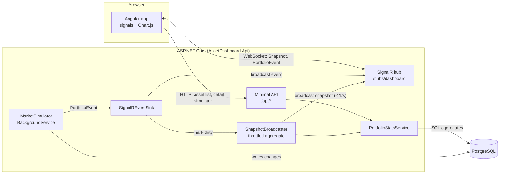

# Architecture

## Overview

## Layers

| Project | Responsibility | Depends on |
|---|---|---|
| `AssetDashboard.Domain` | Entities, enums, pure business maths (valuation, amortisation) | none |
| `AssetDashboard.Infrastructure` | EF Core `DbContext` + migrations, seeding, statistics queries, simulator | Domain, EF Core / Npgsql |
| `AssetDashboard.Api` | HTTP endpoints, SignalR hub, hosting and configuration | Infrastructure |
| `web` (Angular) | UI; talks to the API over REST and SignalR | API contract only |

The simulator does not know about SignalR. It publishes to `IPortfolioEventSink`, which the API
implements. Replacing the simulator with a real change feed doesn't touch the transport.

## Real-time design

There are two message types on one hub (`DashboardHub`). Data flows **server → client**; the
only client → server call is `SetFilter`.

| Message | When | Payload |
|---|---|---|
| `PortfolioEvent` | Every individual change | Small: type, message, ids, amount |
| `Snapshot` | At most once per second, only if something changed (and at least every 30 s) | Full `PortfolioSnapshot` with all KPIs and breakdowns, for the connection's filter |

**Why a throttled snapshot rather than pushing deltas?** Recomputing the aggregates is a handful
of SQL `GROUP BY`s over indexed columns. Changes are coalesced (a dirty flag checked every
second), so a burst of 1,000 events still costs one recompute. Clients stay simple: the latest
snapshot is the whole truth. When a client connects, it immediately gets the latest snapshot plus
the last 50 events.

**Global filters:** each connection watches one `PortfolioFilter` (asset class, country, vendor,
product, underwater only) and belongs to the SignalR group named after the filter's key. The
broadcaster keeps one snapshot per filter that at least one client watches, recomputes them when
the portfolio changes, and sends each to its group. Clients sharing a filter share the work. A
filter nobody watches any more is dropped. `SetFilter` replies straight away with a cached or
freshly computed snapshot, so the UI updates without waiting for the next tick. Events go to
everyone; the client narrows them by category and asset class.

**Scaling out:** with more than one API instance, add the SignalR Redis backplane
(`AddStackExchangeRedis`) or Azure SignalR Service. Only one instance should run the snapshot
recompute (leader election), or the snapshot can be moved to a separate worker.

## From simulator to real data

The client's asset database isn't available yet. `MarketSimulator` stands in for it by changing
the local Postgres database. Options for the real integration, roughly in order of preference:

1. **Change data capture (CDC):** Debezium (or SQL Server CDC, if the source is SQL Server)
   streams row changes to Kafka, Azure Event Hubs or Service Bus. A consumer `BackgroundService`
   maps them to `PortfolioEvent`s and marks the snapshot dirty. This is near real-time and
   decoupled from the source system.
2. **Domain events from the source application:** if the client's systems already publish
   business events (e.g. "asset revalued"), subscribe to them directly.
3. **Postgres `LISTEN/NOTIFY`:** triggers on the replicated tables call `pg_notify`. This is
   simple, but only works when the dashboard reads a Postgres copy.
4. **Polling** on an `UpdatedAt` or rowversion column. This is the simplest option and is
   acceptable for refresh intervals of 30 seconds or more.

In every case, the integration only needs to (a) keep the read model in Postgres up to date and
(b) call `IPortfolioEventSink.PublishAsync`.

## Backend services per view

Each planned page has a read service in `AssetDashboard.Infrastructure` and its endpoints under
`/api`. Every service takes the same `PortfolioFilter`, so filters behave the same everywhere.

| Service | Feeds | Endpoints |
|---|---|---|
| `PortfolioStatsService` | Overview, asset explorer | `/dashboard/snapshot`, `/assets`, `/assets/{id}`, `/assets/export` |
| `PortfolioHistoryService` + `HistoryRecorder` | Trend charts | `/history` |
| `RefinancingService` | Refinancing | `/refinancing/summary`, `/requests`, `/candidates` |
| `RemarketingService` | Remarketing | `/remarketing/summary`, `/cases`, `/auctions` |
| `VendorService` | Vendors | `/vendors`, `/vendors/{id}` |
| `SourceService` + `SourceFeedSimulator` | Sources | `/sources`, `/sources/{id}/runs` |

The services contain no business rules. These sit in the domain project and are unit-tested
there:
- **`CreditRisk`:** probability of default, loss given default, expected loss.
- **`RefinancingPolicy`:** the credit decision on refinancing requests.
- **`RemarketingRules`:** storage rates, selling fees, hammer price.
- **`ValuationModel` and `Amortization`:** asset values and loan repayment schedules.

**Testing:** `tests/AssetDashboard.IntegrationTests` starts the real API against a throwaway
PostgreSQL container (Testcontainers). It calls every endpoint and every simulator step, so EF
Core query-translation errors fail the build rather than the dashboard.

## Large datasets

- Aggregation runs in Postgres (`GROUP BY` with indexes on `Status`, `AssetClass` and
  `DaysPastDue`). No rows are loaded into memory for KPIs.
- The asset list is paged on the server. Search uses `ILIKE`; for millions of rows, add a
  `pg_trgm` GIN index.
- Next steps if the snapshot gets slow: incremental counters updated per event, materialised
  views refreshed on a schedule, or a separate reporting store (read replica or columnar
  storage).
- Seeding streams contracts in chunks and writes them with binary `COPY` (see
  `docs/domain-model.md`, "Seeding at scale").

## Technology choices

| Choice | Why |
|---|---|
| .NET 10 (LTS) | Cross-platform, so development works natively on macOS and runs on Windows or Linux in production |
| Minimal APIs | Less ceremony than controllers for a read-heavy API; can switch to controllers later |
| SignalR | ASP.NET Core's built-in real-time library, with WebSockets plus automatic fallbacks, reconnects and typed hubs |
| EF Core + Npgsql | Standard data access with migrations; `ExecuteUpdate` for bulk changes |
| Angular | Common in enterprise and financial-services frontends; opinionated structure suits larger teams |
| Chart.js | Small, framework-agnostic, wrapped in one component |
