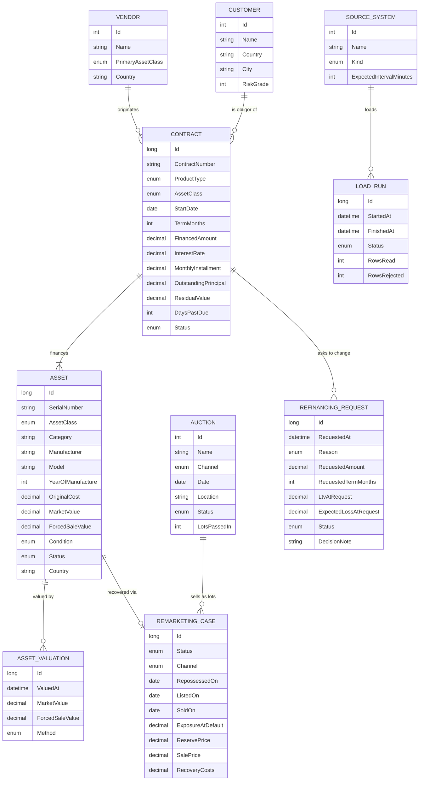

# Domain model

All data is synthetic. The model follows the general mechanics of **vendor finance** (equipment
finance offered through manufacturers and dealers). It's simplified for the exercise.

## Business flow

1. A **vendor** (equipment manufacturer or dealer) sells equipment to a business **customer**.
2. The finance company pays the vendor and enters into a **contract** (lease or loan) with the
   customer, who repays in monthly installments.
3. The equipment is the **asset**. It stays on the finance company's books as collateral (leases)
   or is pledged (loans). It is **revalued** periodically as it depreciates and as used-equipment
   markets move.
4. If the customer falls behind (**days past due**) and eventually **defaults** (90+ dpd), the asset
   is **repossessed** and **remarketed**: sold at live or online auction, privately, or back to the
   vendor. Sale proceeds minus costs are set against the outstanding exposure. The ratio is the
   **recovery rate**.
5. For **refinancing or restructuring**, the current asset value (and its forced sale value)
   determines how much security remains, and therefore the risk and price of new terms.

## Entities

`PORTFOLIO_HISTORY_POINT` (not drawn) holds one row per day for the total and each asset class:
exposure, collateral, forced sale value, 30+ and 90+ dpd exposure and net recoveries.

**Fields added for the planned views:**

| Entity | Fields |
|---|---|
| Contract | `MaturityDate` (start + term; the balloon falls due then) |
| Vendor | `ProgramType` (manufacturer, dealer, distributor), `Recourse` (none, partial, full, buy-back), `Rating` A–D, `OnboardedOn`, `AnnualVolumeTarget` |
| RemarketingCase | `AuctionId`, `Bids`, `TimesPassedIn`, `AskingPrice`, `PriceReductions`, `Yard`, `DailyStorageRate`, cost breakdown (`TransportCost`, `StorageCost`, `RefurbishmentCost`, `SellingFees`; `RecoveryCosts` is their sum) |

### Key terms

| Term | Meaning |
|---|---|
| Exposure | Outstanding principal still owed on open contracts |
| Market value (fair market value) | What the asset would fetch in a normal sale |
| Forced sale value (FSV) | Expected proceeds from a quick sale (auction after repossession) |
| LTV | Exposure ÷ collateral market value. Above 100% means "underwater" |
| Forced sale shortfall | Σ max(0, exposure − FSV) per contract: loss if all were liquidated now |
| DPD | Days past due; buckets: current, 1–29, 30–59, 60–89, 90+ |
| Recovery rate | (sale proceeds − recovery costs) ÷ exposure at default |
| PD | One-year probability of default: 0.3% (grade 1) to 20% (grade 10), ×1.5 / ×3 / ×5 for 1–29 / 30–59 / 60–89 dpd, 100% at 90+ |
| LGD | Share of exposure not covered by the forced sale value net of 6% remarketing costs |
| Expected loss | PD × LGD × exposure |
| Maturity wall | Exposure (and balloon amounts) falling due per quarter |
| Sell-through | Lots sold ÷ lots offered at an auction (sold + passed in) |
| Freshness | Time since a source's last successful load: Fresh ≤ 1.5×, Late ≤ 3×, Stale beyond its expected interval |

### State machines

**Contract:** `Active ⇄ Delinquent (30–89 dpd) → Defaulted (90+) → Closed`, plus `Restructured`.

**Asset:** `InUse → Repossessed → InRemarketing → Sold`, plus `Returned` (end of an operating lease).

## Synthetic data assumptions

The generator (`PortfolioGenerator`, seeded and deterministic) uses these assumptions.

**Portfolio mix:** Agriculture 25%, Construction 20%, Transportation 18%, Technology 12%,
Healthcare 10%, Material handling 10%, CleanTech 5%. Countries: eurozone, with NL and DE the
largest.

**Vendors:** about one per 120 contracts, with skewed volumes (a few large partners write most of
the business).

**Contracts:**
- Term depends on the asset class: 24–48 months for tech, up to 120 for CleanTech.
- Product mix depends on the class: tech mostly operating lease; transport mostly hire purchase.
- Down payment: 0–10% for leases, 10–25% for loans.
- Residual value: 20–35% for operating leases, 5–15% for finance leases.
- Interest is about 2.5% + 0.45% × risk grade, with an extra margin for tech.
- Installments use the standard annuity formula with a balloon.

**Credit:**
- Customer risk grade is roughly normally distributed around 5 (on a 1–10 scale).
- Probability of default is 0.25% × grade^1.6: about 0.25% for grade 1 and about 10% for grade 10.
- Delinquent customers have unpaid installments added back to their balance.

**Valuation:** declining-balance depreciation per class, plus a first-year drop, a condition factor
and a per-class market index (random walk), with a salvage floor.

| Class | 1st-year drop | Annual depreciation | Floor | FSV / market value |
|---|---|---|---|---|
| Agriculture | 10% | 11% | 15% | 75% |
| Construction | 12% | 13% | 12% | 70% |
| Healthcare | 15% | 17% | 5% | 50% |
| Technology | 20% | 30% | 2% | 35% |
| Transportation | 12% | 16% | 8% | 70% |
| Material handling | 10% | 12% | 10% | 65% |
| CleanTech | 8% | 7% | 10% | 55% |

**Remarketing:**
- About 35% of older defaults are fully resolved (sold, contract closed).
- Sale price follows a normal distribution around the forced sale value (σ 12%).
- Recovery costs are 3–8% of value plus a fixed amount.
- Channel depends on the asset class: auctions for agriculture and construction, vendor buy-back
  for healthcare and tech.

**Resulting portfolio (20k contracts):**
- About 31k assets and 113k valuations.
- Loan-to-value about 69%; healthcare and tech above 100%, because that equipment depreciates
  fast.
- About 3.5% defaulted and about 4% delinquent.
- Recovery rate about 60%.

**Refinancing:**
- About 4% of open contracts have a request in the last year; every restructured contract has an
  approved cash-flow-stress request.
- Reasons follow the contract: arrears lead to cash-flow stress, a residual due within 9 months to a
  balloon refinancing, a good grade sometimes to a rate reduction, otherwise expansion.
- Decisions follow `RefinancingPolicy`: decline above 110% requested LTV, at grade 9+, for rate cuts
  above grade 4, or when already in default. Otherwise approve, with a rate add-on for grade, LTV
  above 85% and arrears.

**Auctions and costs:**
- Auctions run on Thursdays per channel (live or online) and country. Past ones are completed;
  upcoming ones hold the currently listed lots.
- Hammer price is about 0.75 + 0.03 × bids (capped at 15 bids) times the forced sale value, plus
  noise. About 15–20% of lots are passed in at least once.
- Costs: transport is 1–3% of value plus €500–2,500; storage is €8–45 per day by class;
  refurbishment is 1–5% of value for half of the assets; seller fees are 8% (live auction),
  5% (online), 2% (private) or 0% (vendor buy-back).

**Vendors:** imaging, IT and clean-tech programmes are mostly manufacturer-led with buy-back;
machinery is mostly dealer-led with partial or no recourse. Ratings are A 20%, B 45%, C 28%,
D 7%. Volume targets are 85–135% of last year's actual origination.

**History:** 24 months back from today's real figures. Exposure grows into today at 6–18% a year
depending on the class; LTV and arrears follow mean-reverting random walks, with arrears peaking
in winter.

**Source systems** (all fictional):

| Source | Frequency | Failure rate | Warning rate |
|---|---|---|---|
| Core leasing system | 15 min | 2% | 4% |
| Equipment valuation feed | daily | 3% | 8% |
| Auction results feed | hourly | 4% | 5% |
| Credit bureau scores | daily | 2% | 3% |
| General ledger (ERP) | 6-hourly | 2% | 6% |

## Seeding at scale

Seeding streams contracts in chunks of 10,000. It assigns keys on the client and writes every
table with PostgreSQL binary `COPY` (`BulkCopy`, driven by the EF Core model). Afterwards it resets
the identity sequences and runs `ANALYZE`. Memory stays flat regardless of portfolio size.

## Simulator

`MarketSimulator` makes about 4 changes per second:

| Change | Share of events |
|---|---|
| Revaluations | 40% |
| Payments received | 25% |
| Missed payments (skewed to weaker customers) | 17% |
| Repossessions of defaulted contracts | 8% |
| Listings | 2% |
| Private sales / vendor buy-back | 2% |
| Market shocks (a whole asset class moves 2–6%, applied with one bulk `UPDATE`) | 1% |
| Refinancing requests / decisions (approval re-prices the contract) | 1.5% / 1.5% |
| Auctions run (lots sold or passed in) / asking-price cuts | 1% / 1% |

Separately, `SourceFeedSimulator` runs each source's loads on schedule and reports failures and
recoveries to the live feed, and `HistoryRecorder` refreshes today's history rows every 5 minutes.
